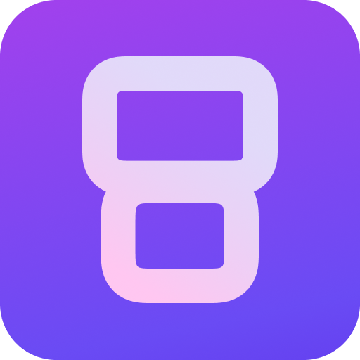
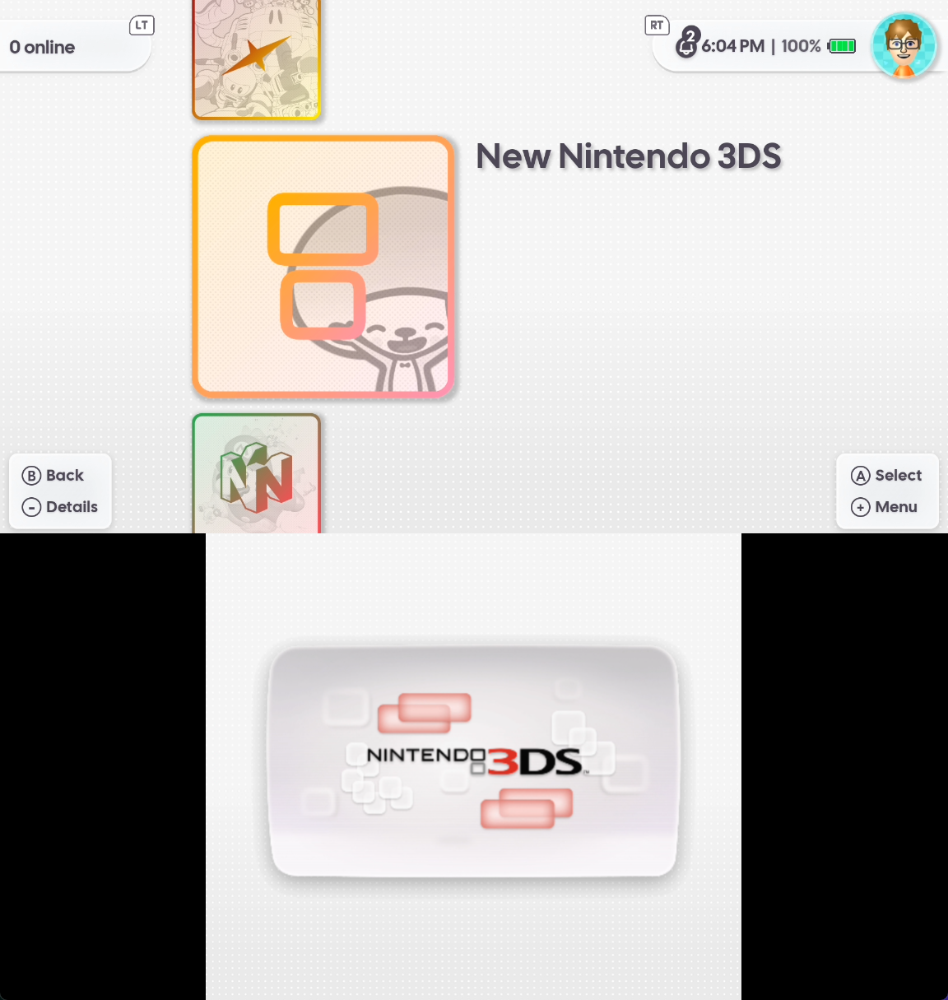
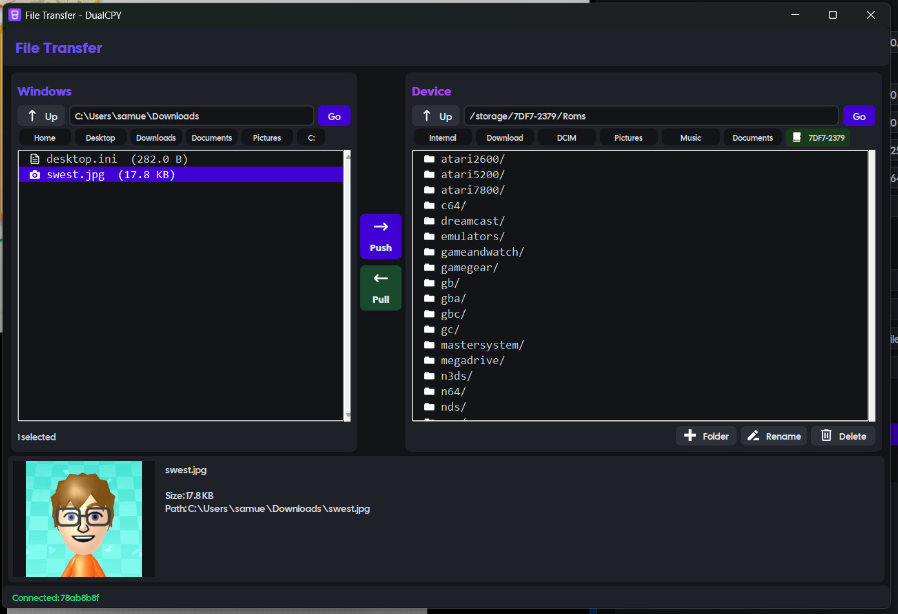
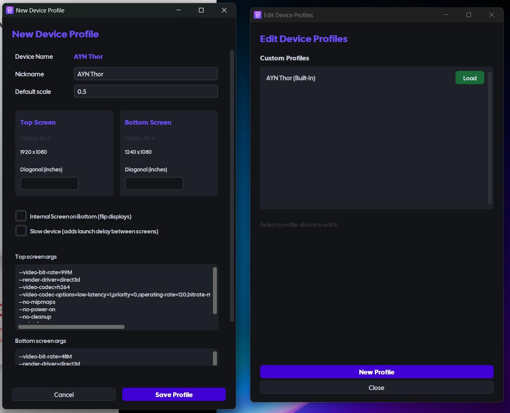

<p align="center">
  
  &nbsp;&nbsp;
  
</p>

> [!NOTE]
> **DualCPY-Linux** is the Linux port of [DualCPY](https://github.com/theswest/DualCPY)
> (previously **ThorCPY**). As of v1.0.0 the project supports all dual-screen Android
> handhelds — not just the AYN Thor — and has been renamed to **DualCPY**.

DualCPY-Linux *(pronounced "Dual Copy")* is a Linux multi-window scrcpy launcher,
designed specifically for dual-screen Android handhelds.
It features a layout editor, window docking, screenshots, file transfer, device
profiles, and real-time window positioning.

It launches two scrcpy windows (one per display) and embeds them into a single
container window on **X11** — ideal for screensharing, recording, or livestreaming.
On **Wayland** it runs in floating mode via XWayland.

**DualCPY-Linux targets Linux with X11 (recommended) or Wayland (floating mode).**

**For the Windows version, see the upstream project: https://github.com/theswest/DualCPY**

Please report Linux-specific issues at https://github.com/DrSkyfaR/DualCPY-Linux/issues

<h2 align="center">Screenshots</h2>

<table align="center">
  <tr>
    <td align="center"><b>Control Panel</b></td>
    <td align="center"><b>Dual-Screen Capture</b></td>
  </tr>
  <tr>
    <td></td>
    <td></td>
  </tr>
  <tr>
    <td align="center"><b>File Transfer</b></td>
    <td align="center"><b>Device Profiles</b></td>
  </tr>
  <tr>
    <td></td>
    <td></td>
  </tr>
</table>

## What's New in 1.0.0

- Rebranded from ThorCPY-Linux to **DualCPY-Linux**, with a brand-new logo
- Complete UI rewrite in **customtkinter**, with a cleaner, more modern design language
  (replaces the previous pygame control panel)
- **Multi-device support** with automatic device detection and built-in profiles
  for many handhelds
- **Profile editor** for custom devices, screen sizes, internal monitors, and
  per-profile scrcpy commands
- **File Transfer window** for two-way file management over ADB (@DrSkyfaR & @theswest)
- **Gamepad passthrough** to the device
- **FPS selector** and **Restart** button in the control panel (@tommywaaf)
- Undocked windows keep their window-manager title bars for easy resizing and moving
- Tuned scrcpy launch for low latency; requires **scrcpy v4.0+**

See the full [CHANGELOG](CHANGELOG.md) for details.

## Features

- Multi-device support with built-in profiles for many dual-screen handhelds
  (AYN Thor, RG DS, Pocket DS, AYN Odin 3 / Odin 2 / 2 Portal / 2 Mini + RDS,
  Retroid Pocket 6 / G2 / 5 / 4 Pro + RDS, and more), plus custom user-defined profiles
- Automatic device detection over ADB, with a device selector on launch and smart
  selection of the connected device
- "Last used profile" is remembered per-device and auto-booted on launch
- Both wired (USB) and wireless (ADB over WiFi, Android 11+ pairing) connection,
  plus a network scanner that auto-discovers devices on your subnet
- **X11 docking** — embed both screens into one container window, or undock them into
  independent, resizable, title-barred windows for individual capture (e.g. streaming)
- **Wayland support** — floating window mode via XWayland (docking not possible on pure Wayland)
- Layout presets to position the screens precisely how you want
- Screenshot capture grabs both screens together (saved as a PNG via `mss`)
- File transfer to and from the device over ADB, with image previews, file metadata,
  and quick-nav shortcuts on both the local-PC and device sides
- Profile editor for custom screen sizes, internal-monitor layouts, and per-profile
  scrcpy launch commands
- Gamepad passthrough to the device (`--gamepad=uhid` on the top screen)
- FPS selector and restart controls in the panel
- Real-time positioning to move the screens into any arrangement
- **Linux extra:** optional Discord audio routing via PipeWire/PulseAudio so game
  audio is captured automatically during a screen-share

## Installation

> [!IMPORTANT]
> **To use DualCPY-Linux, you must have *USB Debugging* enabled.**
> 1. On the device, go to **Settings > About device**.
> 2. Tap the **Build number** seven times to unlock **Settings > Developer options**.
> 3. Enable **USB Debugging** in Developer options.
>
> Then connect your device via USB, or just launch DualCPY-Linux to start the
> wireless connection dialog.

### System dependencies

Install `git`, `adb`, and **scrcpy ≥ 4.0** plus the X11 dev headers from your distro.
DualCPY-Linux can also attempt to install `adb`/`scrcpy` automatically on first
launch via `pkexec` (pacman and apt-get supported).

**Arch / Manjaro / CachyOS**
```bash
sudo pacman -S git base-devel android-tools scrcpy python-xlib tk
```

**Debian / Ubuntu**
```bash
sudo apt install git adb scrcpy python3-dev python3-xlib python3-venv build-essential tk
```
> On older Debian, `scrcpy` may be available via backports.

### Option 1: Run from Source (recommended)
```bash
git clone https://github.com/DrSkyfaR/DualCPY-Linux.git
cd DualCPY-Linux
python3 -m venv venv
source venv/bin/activate
pip install -r requirements.txt
python main.py
```
> Using fish or csh? Use the following activation script instead: `source venv/bin/activate.fish` (fish) or `activate.csh` (csh).

> Re-activate the venv (`source venv/bin/activate`) before running in later sessions.

### Option 2: Build a Standalone Executable
```bash
source venv/bin/activate
pip install pyinstaller
python build.py
# Find your build in dist/DualCPY/
```

**Note:** unlike the Windows build, scrcpy and ADB are **not bundled** on Linux —
they come from your system (or are auto-installed via `pkexec`).

## Requirements

### System
- **OS:** Linux with X11 (recommended) or Wayland (floating mode via XWayland)
- **Python:** 3.9 or higher (tested on 3.14)
- **scrcpy:** v4.0 or higher
- **Device:** a dual-screen Android handheld with USB Debugging enabled

### Python Dependencies
Installed with `pip install -r requirements.txt`:
- `customtkinter` — control panel / dialog UI
- `pillow` — icons and image previews
- `mss` — cross-platform screenshots
- `darkdetect` — appearance-mode detection
- `python-xlib` — X11 window management (Linux only)
- `pyinstaller` — only needed to build a standalone executable

## Usage

### Connection
- You can connect via USB (charging, offline, more stable) or wirelessly (no tethers).
- **USB:** ensure USB Debugging is enabled, plug in your device, and launch DualCPY-Linux.
- **Wireless:**
  - Launch DualCPY-Linux without a USB device connected and open the **Wireless** dialog.
  - On the device, enable **Wireless debugging** and open **Pair device with pairing code**.
  - Enter the IP address, port, and pairing code shown.
  - Once paired, copy the device's IP and port into the **Connect by IP** field.
  - Close the dialog — DualCPY-Linux connects and starts mirroring.

### Device Selection
- On launch, DualCPY-Linux detects connected devices over ADB and auto-matches the
  best profile (with an AYN Thor fallback), remembering the last used profile per device.
- Don't see your device matched? Use the **Edit Device Profiles** editor to add a custom
  profile (screen sizes, internal-monitor layout, and per-profile scrcpy launch command).

### Main Controls
The control panel appears on the right-hand side of your screen:
- **Global Scale** — adjust the scale of the scrcpy outputs (requires restart)
- **FPS** — select the target framerate (top window; bottom capped to ≤60)
- **Restart** — restart the mirroring session
- **Layout:** Top X / Top Y and Bottom X / Bottom Y position each screen
- **Window controls:**
  - **Undock** — separate into independent, title-barred floating windows (for individual capture)
  - **Dock** — bring undocked windows back into one unified container (X11 only)
  - **Screenshot** — capture the docked view to a PNG in `screenshots/`
- **File Transfer** — open the file browser to move files between your PC and device
- **Presets** — name a layout and **Save**; **Load** / **Del** next to a saved preset

### File Transfer
- Transfer files in both directions (local PC ↔ device) over ADB.
- Create folders, rename, and delete on either side.
- Local quick-nav: Home, Desktop, Downloads, Documents, Pictures
- Device quick-nav: Internal, Download, DCIM, Pictures, Music, Documents
- Automatic SD-card detection with quick-nav pills
- Inline image previews with file metadata

## Configuration

### Layouts / Presets — `config/layout.json`
```json
{
    "Default":   { "tx": 0,   "ty": 0,  "bx": 251, "by": 648, "global_scale": 0.6 },
    "Streaming": { "tx": 100, "ty": 50, "bx": 300, "by": 700, "global_scale": 0.3 }
}
```

### General Config — `config/config.json`
```json
{
    "tx": 0, "ty": 0, "bx": 250, "by": 648, "global_scale": 0.6,
    "max_fps": 120,
    "device_profiles": { "78ab8b8f": "ayn_thor" },
    "last_profile": "AYN Thor",
    "discord_audio_routing": true
}
```

### Custom Profiles — `config/custom_profiles.json`
User-defined device profiles created in the profile editor are stored here.

### Logging — `logs/`
- `dualcpy_YYYYMMDD.log` — main application log
- `scrcpy_top_YYYYMMDD_HHMMSS.log` / `scrcpy_bottom_YYYYMMDD_HHMMSS.log` — per-window scrcpy output

To adjust verbosity, change the logging level in `main.py`:
```python
logging.basicConfig(
    level=logging.INFO,  # Change to DEBUG for detailed logs
    ...
)
```

## Troubleshooting

### Layout issues
- Load a preset at 0.6 global scale and save it.
- Delete `config/layout.json` and `config/config.json` so they are regenerated.

### Device not found
- Ensure USB debugging is enabled — try a different (data, not charging-only) cable.
- Revoke USB-debugging authorizations and reconnect (Developer Options).
- Check that ADB sees your device: `adb devices`
- Restart the ADB server: `adb kill-server && adb start-server`

### scrcpy won't start
- Ensure `scrcpy` (≥ 4.0) is installed and on your `PATH`.
- Check the per-window logs in `logs/` for the exact error.
- Try running scrcpy manually: `scrcpy -s YOUR_DEVICE_SERIAL`
- Ensure your device exposes the display IDs expected by your profile.

### Windows won't dock (X11)
- Wait a few seconds for the windows to initialise, then toggle dock/undock.
- Make sure you are on an **X11** session (`echo $XDG_SESSION_TYPE`).
- Restart the application and check the logs.

### Running on Wayland
- Docking requires X11. With XWayland present, DualCPY-Linux forces the X11 backend
  automatically; on **pure Wayland** only floating mode is available.

### Graphical glitches
- Toggle dock/undock a few times, or restart the application.
- Try a wireless connection to rule out USB issues.
- Check the logs for errors.

### Performance / stuttering
- Reduce the global scale or lower the FPS in the control panel.
- Close other resource-intensive applications; prefer a USB 3 port.
- Increase the per-profile **screen-launch delay** for lower-powered devices.

### Gamepad not detected
- You may need to reconnect your controller while DualCPY-Linux is running — this is
  an Android limitation with `--gamepad=uhid`.

### Missing module / import errors
- Activate the venv and reinstall: `pip install -r requirements.txt --force-reinstall`
- Ensure Python 3.9+ and the `python-xlib` system package are installed.

### Running in a Distrobox container (Bazzite / immutable systems)
DualCPY-Linux runs inside a [Distrobox](https://distrobox.it/) container on immutable
systems. Install the system dependencies inside the container, create a venv, and run
as above. Make sure the container can reach the host display (`DISPLAY`/`WAYLAND_DISPLAY`)
and that `adb` can see your device.

## Licenses

- This project is licensed under the **GNU General Public License v3.0** — see
  [LICENSE](LICENSE). You may modify and redistribute it under the same terms.
- [scrcpy](https://github.com/Genymobile/scrcpy) is used as-is from your system under
  the Apache License 2.0.
- The in-app font is [Cal Sans](https://github.com/calcom/font), under the SIL Open
  Font License 1.1 — see [assets/fonts/OFL.txt](assets/fonts/OFL.txt).

## Contributing

- For **Linux-specific** bugs or features: open an issue in **this repository** on
  [GitHub](https://github.com/DrSkyfaR/DualCPY-Linux/issues).
- For general **DualCPY** issues (Windows / upstream): see the
  [upstream repository](https://github.com/theswest/DualCPY/issues).

Pull requests are welcome — for major changes, please open an issue first.

## Supporting

Support the original author: https://ko-fi.com/theswest

## Acknowledgements

- **[the_swest](https://github.com/theswest)** — original DualCPY (ThorCPY) author
- **[DrSkyfaR](https://github.com/DrSkyfaR)** — File Transfer logic and the Linux port
- **[tommywaaf](https://github.com/tommywaaf)** — backend performance work, FPS/restart
  controls, title-barred undocked windows, and more
- **[eldermonkey](https://github.com/eldermonkey)** — project logo
- **[scrcpy](https://github.com/Genymobile/scrcpy)** by Romain Vimont — the backend
- **[Cal Sans](https://github.com/calcom/font)** by Cal.com Inc. — UI typography (OFL 1.1)
- **[customtkinter](https://github.com/TomSchimansky/CustomTkinter)** — modern UI toolkit
- **[python-xlib](https://github.com/python-xlib/python-xlib)** — X11 window docking
- All other contributors and testers, especially **dd**, **splain**, and everyone else who helped!
